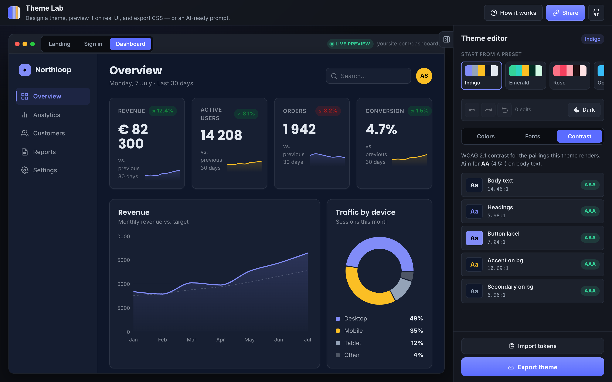

<div align="center">


# Theme Lab

**Design a color theme, preview it on real UI, and export the CSS — instantly.**

Theme Lab is a live theme editor. Pick five colors and two fonts, watch them apply in real time to a real landing page, sign‑in screen and dashboard, keep an eye on WCAG contrast as you go, then export production‑ready CSS (or Tailwind / JSON) — or share the exact theme with a link. No account, nothing to install.

[**▶ Live demo**](https://react-color-tester.vercel.app/) · Built with React + Vite + chroma‑js

[](https://github.com/Hashtagsmile/react-color-tester/actions/workflows/ci.yml)
[](LICENSE)



</div>

---

## Why it exists

Most color pickers show you swatches in a vacuum. The hard part isn't picking a nice blue — it's seeing how a whole palette behaves across real components, in light **and** dark, without failing contrast.

That matters more now, not less. An assistant will hand you a palette in seconds; what it can't tell you is whether the thing survives contact with a real page. So Theme Lab works in both directions: design a theme here, **or paste in the tokens something else generated** and find out what they actually look like before you ship them.

## Features

- 📋 **Import anything** — paste CSS custom properties, a Tailwind config or JSON. Alias names (`brand`, `surface`, `ink`, `fg`) and scale suffixes (`-500`) are understood; missing roles are reported rather than invented.
- ♿ **Live WCAG contrast** — every pairing the preview actually renders is graded AA / AAA / Fail in real time.
- 🎨 **Five‑role palette** — primary, secondary, accent, background and text, edited live with the native color picker.
- 🔤 **Font pairing** — 20+ heading/body typefaces (Google Fonts + system), with live previews.
- 🖥️ **Real preview surfaces** — a marketing landing page, a sign‑in screen and an analytics dashboard, all re‑skinned instantly.
- 🌗 **Light & dark** — toggle the preview mode; custom themes derive a matching variant automatically.
- 🎲 **Presets, randomize & lock** — start from a curated preset, lock the colors you love, and randomize the rest around them.
- ↩️ **Undo / redo** — a proper history stack for every change.
- 📦 **Export** — CSS custom properties, a Tailwind config, JSON, or an AI‑ready brief — in HEX / RGB / HSL.
- 🔗 **Shareable links** — the full theme is encoded in the URL, and your work is auto‑saved to `localStorage`.
- 🤖 **CLI + MCP server** — gate contrast in CI, or let a coding assistant check its own palette. See below.

## How it works

1. **Start a palette** — a preset, from scratch, or paste tokens you already have.
2. **See it on real UI** — switch between the landing / sign‑in / dashboard tabs and toggle dark mode.
3. **Check, then ship** — read the contrast grades, then export the CSS or copy a link that reopens your exact theme.

## Beyond the browser

The colour maths lives in a dependency‑light TypeScript core (`src/lib/`) that the web app, a CLI and an MCP server all share — so a palette can't pass in one place and fail in another.

### Contrast gate for CI

```bash
npm run build:node
npx theme-lab check src/styles/tokens.css     # exits 1 if any pairing drops below AA
npx theme-lab check tokens.css --min aaa --json
npx theme-lab export tokens.css tailwind
```

Assistants generate a lot of CSS. This turns "did the palette stay accessible" into a build step instead of something a human has to catch in review. This repo's own CI runs it against the default theme.

### MCP server

Lets Claude Code, Cursor or any MCP client check a palette *before* it writes the CSS:

```json
{
  "mcpServers": {
    "theme-lab": { "command": "node", "args": ["/path/to/react-color-tester/dist-node/mcp/server.js"] }
  }
}
```

| Tool | Does |
|---|---|
| `check_contrast` | Grades a palette against WCAG 2.1, with advice on what to change |
| `export_theme` | Converts a palette to CSS / Tailwind / JSON / a design brief |
| `parse_tokens` | Reads a palette out of an existing codebase's tokens |
| `preview_theme` | Returns a share link so a human can eyeball it on real UI |

## Tech stack

| Area | Choice |
|---|---|
| Framework | React 18 + Vite (SWC) |
| Core logic | TypeScript (strict), DOM‑free so Node can import it |
| Tests | Vitest — 64 covering colour maths, parser, exporters, presets, MCP |
| Routing | React Router, dashboard route lazy‑loaded |
| Color math | chroma‑js (conversions, contrast, scales) |
| Charts | Recharts |
| Icons | react‑icons |
| State | `useReducer` + Context, persisted to `localStorage` |
| Agent interface | `@modelcontextprotocol/sdk` over stdio |
| CI | ESLint, `tsc`, Vitest, both builds, and a WCAG contrast gate |

## Architecture notes

- **Chrome vs. canvas.** The app's own UI (top bar, sidebar) uses a fixed dark palette (`--app-*` variables) and never re‑themes. Only the preview surface — everything inside `.preview-surface` — consumes the live theme tokens (`--color-*`, `--*-font-family`). This keeps the tool readable while the canvas changes underneath it.
- **One source of truth.** All theme state lives in a single `useReducer` in [`ThemeContext`](src/contexts/ThemeContext.jsx): a theme object, lock map, and immutable undo/redo stacks. Live drags update without spamming history; the gesture is folded into one undoable edit on release.
- **Typed core, untyped views.** All the logic — colour maths, variant generation, the parser, the exporters, the audit — is strict TypeScript in [`src/lib/`](src/lib), with no DOM access, so Node can import it. Components stay JSX: types earn their keep on a five-role palette and a lock map, not on presentational markup.
- **One grader.** [`auditPalette`](src/lib/audit.ts) is the only implementation of "does this pass", shared by the sidebar, the CLI and the MCP server. It grades what the DOM paints — button labels are measured against the derived `--on-primary`, not the palette's background slot, so it can't report a failure the user is unable to fix.

📄 **[How it was built](docs/HOW_IT_WAS_BUILT.md)** — the longer version: why the chrome/canvas split exists, how the undo stack survives a color drag, and the unbounded loop that used to hang the tab.

## Getting started

**Prerequisites:** Node.js 20+ and npm.

```bash
git clone https://github.com/Hashtagsmile/react-color-tester.git
cd react-color-tester
npm install
npm run dev          # start the dev server (Vite, HMR)
```

Then open the local URL Vite prints (default `http://localhost:5173`).

```bash
npm run build        # production build → dist/
npm run build:node   # compile the shared core, CLI and MCP server → dist-node/
npm run test         # Vitest — colour maths, parser, exporters, presets, MCP
npm run typecheck    # tsc over src/lib, src/data, tests, bin, mcp
npm run lint         # ESLint
```

## Tests

`npm test` covers the parts where being wrong is silent: WCAG ratios against reference values, `encodeTheme`/`decodeTheme` round‑trips, the bounded contrast loop, parser behaviour across CSS / Tailwind / JSON, export→import round‑trips, and an end‑to‑end run of the MCP server over stdio.

There's also a test asserting every bundled preset passes its own grader. It was worth writing: when first run, **9 of 11 light presets failed** — including the one named "High Contrast", whose amber accent sat at 1.92:1 on white.

## Roadmap

- [ ] Adjustable type scale (heading/body sizes) reflected in the export
- [ ] More export targets (SCSS, design tokens / Style Dictionary)
- [ ] Saveable palette gallery
- [ ] Import a palette from an image

## License

[MIT](LICENSE)
